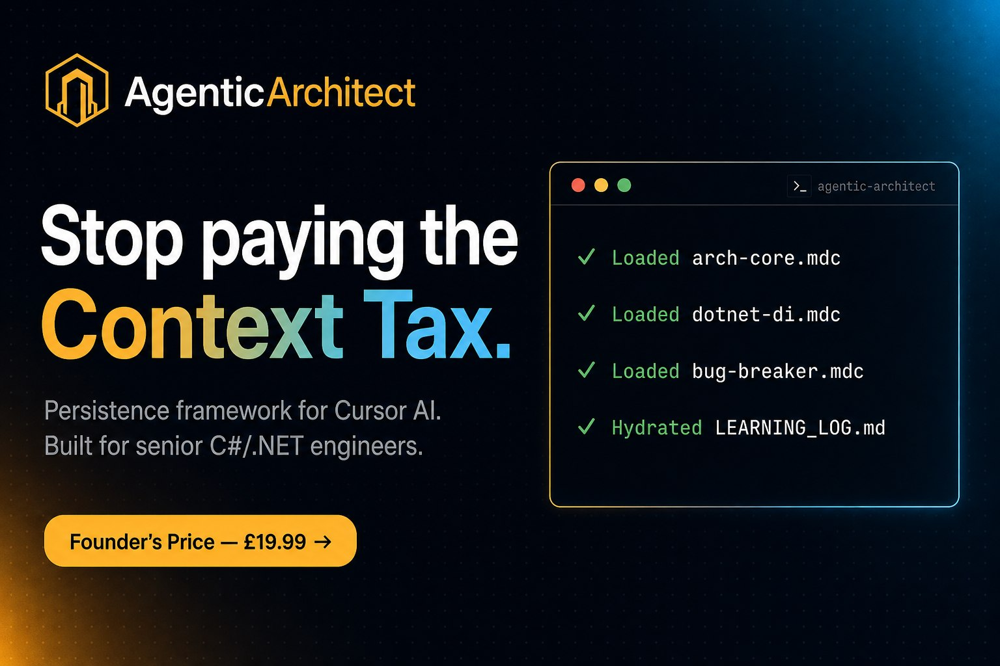

<div align="center">



# 🏛️ Agentic Architect

### The Persistence Framework for Cursor — built for senior C#/.NET engineers

[](arch-core-lite.mdc?utm_source=github_readme&utm_medium=badge&utm_campaign=free_sample)
[](https://agenticarchitect.gumroad.com/l/dotnet-persistence-kit?utm_source=github_readme&utm_medium=badge&utm_campaign=paid_kit)
[](LICENSE)
[](https://agenticarchitect.gumroad.com/l/dotnet-persistence-kit?utm_source=github_readme&utm_medium=badge&utm_campaign=paid_kit)

#### 🌐 **[Visit the website →](https://agenticstandardcontact-byte.github.io/agentic-architect/)**

**Stop re-explaining your architecture to your AI every single morning.**

</div>

---

## 🧠 The "Context Tax"

Every senior developer using Cursor pays a hidden tax: **15+ minutes a day** re-explaining DI patterns, project boundaries, and architectural decisions the AI forgot the moment you closed the last session.

At a senior billing rate that's **~£4,650 of lost time per engineer, per year**.

This isn't a Cursor problem. It's a **persistence problem**.

## 🛡 The Solution

Agentic Architect is **not** another prompt pack. It's a **directory-level configuration system** of four scoped `.mdc` rules plus a stateful persistence engine that gives Cursor true long-term memory across sessions.

```
your-dotnet-project/
├── .cursor/
│   └── rules/
│       ├── arch-core.mdc         # SOLID boundaries enforcement
│       ├── dotnet-di.mdc         # DI + service-lifetime auditor
│       ├── bug-breaker.mdc       # Hallucination-loop circuit breaker
│       └── persistence.mdc       # The Learning Log engine
└── LEARNING_LOG.md               # Your project's stateful "brain"
```

## 📦 What's Inside the Kit

| Rule | What it does |
|---|---|
| **`arch-core.mdc`** | Enforces SOLID boundaries. Detects which layer the current file lives in (Domain / Application / Infrastructure / Api) and refuses suggestions that cross it. No more EF Core in your Domain layer. |
| **`dotnet-di.mdc`** | Specialised auditor for constructor injection and service lifetimes. Catches Scoped→Singleton capture bugs before they ship. Knows `IServiceCollection`, Scrutor, Autofac patterns by heart. |
| **`bug-breaker.mdc`** | A circuit breaker that stops the AI when it enters a hallucination loop. Forces a re-read of the file and a targeted question instead of doubling down. |
| **`persistence.mdc`** ⭐ | The engine. Maintains your `LEARNING_LOG.md` — the persistent "brain" of your project. Every architectural decision gets logged and re-hydrated automatically across sessions. |

### Plus

- 📘 **Quickstart PDF** — zero to hydrated in 60 seconds
- 🧩 **`LEARNING_LOG.md` template** — pre-seeded for a typical .NET solution
- 🛠 **Daily Senior Rule updates** — new patterns dropped via [the blog](https://agenticstandardcontact-byte.github.io/agentic-architect/blog/)
- ♾ **Lifetime updates** — future rules and protocol upgrades free

## 🆓 Try one rule, free

[**Download `arch-core-lite.mdc`**](arch-core-lite.mdc) — a real, production-ready preview of the boundary-guardian rule. Drop it into `.cursor/rules/` and watch your AI refuse to import EF Core in your Domain layer.

> Free download. No signup. Just the file.

## 🚀 Quickstart (60 seconds)

```bash
# 1. Get the kit from Gumroad
#    → https://agenticarchitect.gumroad.com/l/dotnet-persistence-kit

# 2. Drop the rules into your project
mkdir -p .cursor/rules
cp ~/Downloads/agentic-architect/*.mdc .cursor/rules/

# 3. Seed the Learning Log
cp ~/Downloads/agentic-architect/LEARNING_LOG.template.md LEARNING_LOG.md

# 4. Open Cursor and ask:
#    "Hydrate the Learning Log from the current codebase."
#    The AI scans your repo and seeds the log with detected patterns.

# 5. Commit
git add .cursor/ LEARNING_LOG.md
git commit -m "chore: install Agentic Architect persistence framework"
```

That's it. Next session, the AI starts hydrated.

## 💰 Pricing

| | |
|---|---|
| **Founder's Edition** | **£19.99** one-time |
| Original price | ~~£49~~ |
| Subscription | None. Pay once, own forever. |
| Updates | Lifetime, free |
| Licence | MIT |
| Guarantee | 14-day no-questions refund |

**[👉 Get the kit — £19.99](https://agenticarchitect.gumroad.com/l/dotnet-persistence-kit)**

## ❓ FAQ

<details>
<summary><b>Isn't this just a few prompt files I could write myself?</b></summary>
<br />
You could — and we did, over hundreds of hours, across real production .NET codebases. The framework isn't the prompts; it's the directory-level loading strategy, the circuit-breaker pattern, and the Learning Log protocol that gives Cursor true statefulness. Writing it yourself is a weekend project. Maintaining it across an evolving architecture is a second job.
</details>

<details>
<summary><b>Will this work with Cursor's built-in rules feature?</b></summary>
<br />
Yes — that's exactly what it's built for. The <code>.mdc</code> files plug directly into Cursor's native rules system. We just use it with discipline.
</details>

<details>
<summary><b>Does it work for non-.NET languages?</b></summary>
<br />
The <code>persistence.mdc</code> engine and <code>bug-breaker.mdc</code> are language-agnostic. <code>arch-core.mdc</code> and <code>dotnet-di.mdc</code> are tuned for C#/.NET. If you're not in the .NET world, you'll get value from 2 of the 4 rules — your call whether £19.99 is worth that.
</details>

<details>
<summary><b>Is it a subscription?</b></summary>
<br />
No. One-time £19.99. Lifetime updates. MIT-licensed. We hate subscriptions as much as you do.
</details>

<details>
<summary><b>How is this different from generic "Cursor rules" repos on GitHub?</b></summary>
<br />
Most public rules are monolithic — a single rule dumped on every prompt, blowing your token budget. Agentic Architect uses scoped, directory-aware loading so only relevant rules activate for the file you're in. Plus, none of them solve persistence — the actual root cause of AI drift.
</details>

<details>
<summary><b>What if it doesn't work for me?</b></summary>
<br />
14-day no-questions refund. Email <a href="mailto:agenticstandardcontact@gmail.com">agenticstandardcontact@gmail.com</a>.
</details>

## 📬 Support

- **Email:** [agenticstandardcontact@gmail.com](mailto:agenticstandardcontact@gmail.com)
- **GitHub Issues:** [Open one →](https://github.com/agenticstandardcontact-byte/agentic-architect/issues)
- **Website:** [agenticstandardcontact-byte.github.io/agentic-architect](https://agenticstandardcontact-byte.github.io/agentic-architect/)

---

<div align="center">

### Stop paying the Context Tax.

**[Get Agentic Architect — £19.99 →](https://agenticarchitect.gumroad.com/l/dotnet-persistence-kit)**

One-time payment · Lifetime updates · 14-day guarantee · MIT-licensed

</div>
